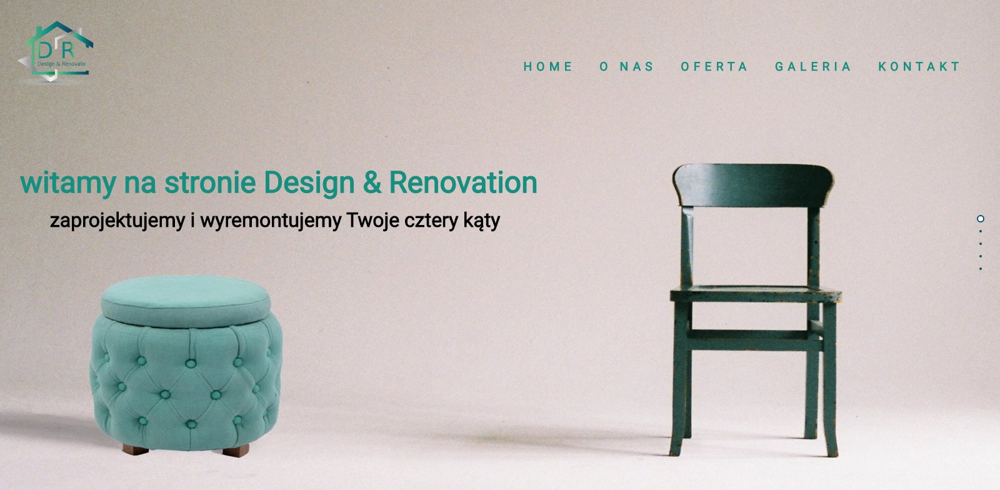

# DR-scroll-website   

Live demo: https://krzysiekk10.github.io/DR-one-page-scroll-website/

## Opis
Strona inspirowana i oparta na fullpage.js wykonana w ramach ćwiczeń i służąca tylko do celów prywatnych. W projekcie w głównej mierze bawiłem się animacjami tekstów oraz grafiką, dodatkowo do galerii zdjęć wykorzystałem bibliotekę lightbox.
Dominująca kolorystyka to szarość oraz zieleń, które odwzorowałem w Adobe. Bardzo zależało mi na zadowalającym i przyjemnym "dla oka" efekcie wizualnym całości projektu. Menu górne/ nawigacja służy tylko do podglądu, a teksty są edytowane z innych stron o podobnej tematyce.   
Responsywność (breakpointy) ustawione na: 576px, 768px oraz 992px.

## Technologie
HTML5 i CSS3

##  Licencje
fullpage.js, obrazki pochodzą z darmowych stron.

