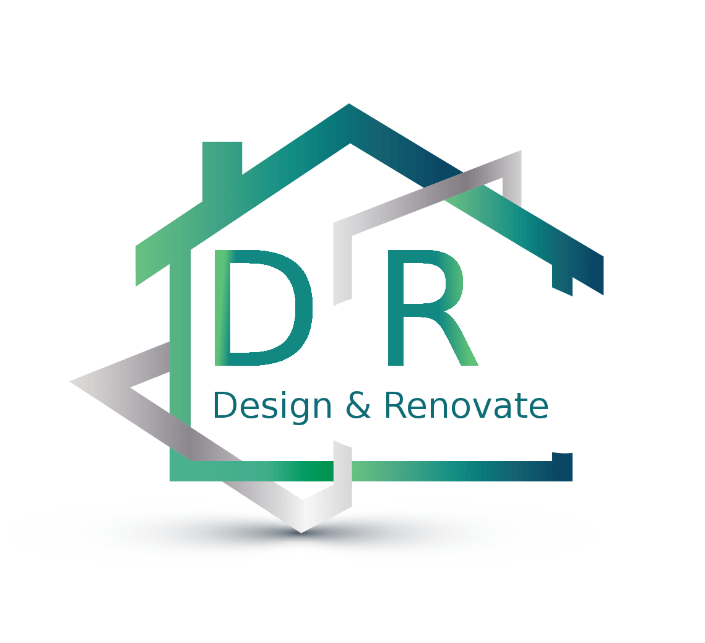
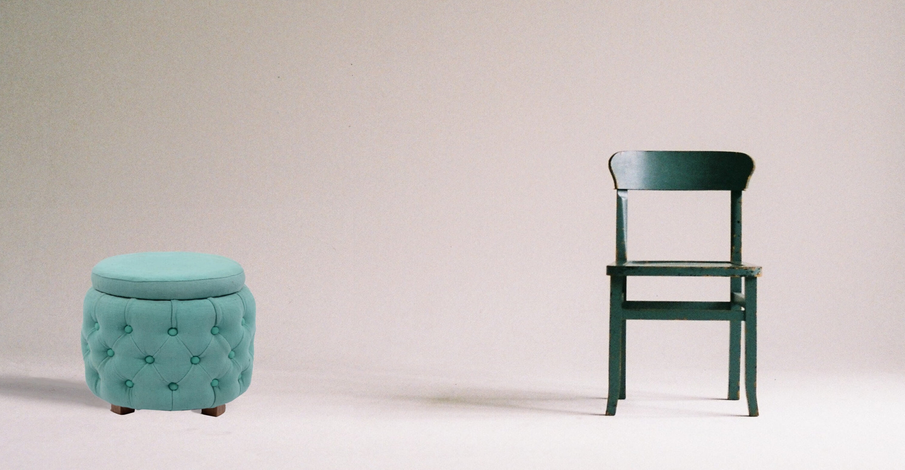

# DR-scroll-website   

## Opis
Strona inspirowana i oparta na fullpage.js wykonana w ramach ćwiczeń i służąca tylko do celów prywatnych. W projekcie w głównej mierze bawiłem się animacjami tekstów oraz grafiką, dodatkowo do galerii zdjęć wykorzystałem bibliotekę lightbox.
Dominująca kolorystyka to szarość oraz zieleń, bardzo zależało mi na zadowalającym efekcie wizualnym całości. Menu górne/ nawigacja służy tylko do podglądu, a teksty są edytowane z innych stron o podobnej tematyce.   
Responsywnośc (breakpointy) ustawione na: 576px, 768px oraz 992px.

## Technologie
HTML5 i CSS3

##  Licencje
fullpage.js, obrazki pochodzą z damowych stron.

